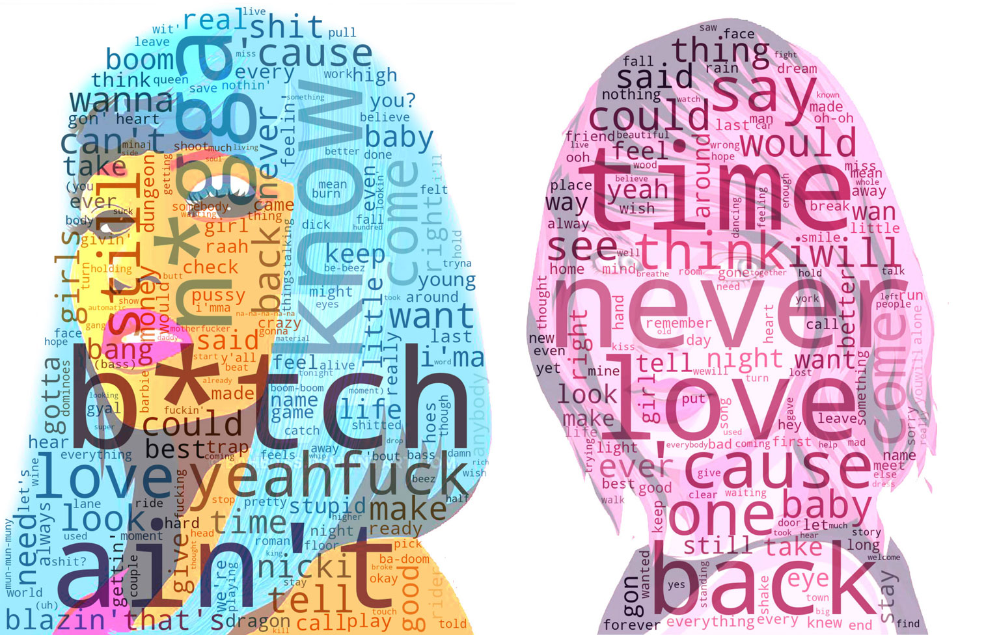

# What are your favorite artists singing about?
### Spotify Data Extraction and Visualization Project

Are you curious about the themes and topics that different performers sing about in their songs? As a music lover, I wanted to dive deeper into the lyrics and understand what messages my favorite artists are conveying through their music.

To make the analysis more interesting and demonstrative, I decided to choose two completely opposite performers, Nicki Minaj and Taylor Swift. Both artists are widely popular, but their music styles and lyrical themes are vastly different.

To begin the analysis, I used web scraping tools such as **Selenium** and **BeautifulSoup** to extract data from **Spotify**, which is a great source for music data. Then, I took all the lyrics from the extracted data and combined them to explore.

Next, I stripped the data of stop words and combined the singular and plural forms of the words to avoid duplication in the word count. Then, I counted the number of each word to determine the most frequently used words in their lyrics.

Finally, I visualized the data using the **Matplotlib** and **Wordcloud** libraries, which allowed me to see the most prominent words used in each artist's music.

The results of my analysis were truly interesting (but expectable) as they revealed a significant contrast between the themes and messages conveyed in the songs of Nicki Minaj and Taylor Swift. To see this difference for yourself, take a look at the comparison picture.

--- 
If you want to explore the discography of your favorite artists in a new way, you can use this code with a detailed description of the process.

